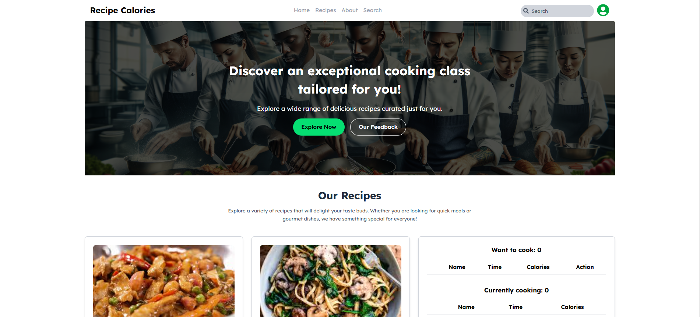

---

# Chef’s Café – Front-End Project

## Table of Contents

- [Overview](#overview)

  - [Screenshot](#screenshot)
  - [Links](#links)

- [Features](#features)
- [Project Structure](#project-structure)
- [Tech Stack](#tech-stack)
- [Getting Started](#getting-started)

  - [Installation](#installation)
  - [Development](#development)

- [Available Scripts](#available-scripts)
- [Styling](#styling)
- [Author](#author)

---

## Overview

A modern, responsive front-end application for a fictional recipe restaurant called **Chef’s Café**. Built using React, Tailwind CSS, and Vite, this project provides a clean and dynamic interface with reusable components and static JSON-powered data.

### Screenshot



### Links

- **Live Demo**: [https://your-cafe-url.vercel.app/](#)
- **GitHub Repo**: [https://github.com/bayzidalways/chef-s-cafe-front_end-project.git](https://github.com/bayzidalways/chef-s-cafe-front_end-project.git)

---

## Features

- 🍳 Dynamic Recipe Cards from `recipes.json`
- 🧑‍🍳 Responsive design with mobile-first approach
- 🔄 Component-driven architecture
- ⚛️ React + Vite for blazing-fast development
- 🎨 Tailwind CSS for styling
- ✅ ESLint for code quality

---

## Project Structure

```
bayzidalways-chef-s-cafe-front_end-project/
├── README.md
├── eslint.config.js
├── index.html
├── package.json
├── tailwind.config.js
├── vite.config.js
├── public/
│   └── recipes.json
└── src/
    ├── App.css
    ├── App.jsx
    ├── index.css
    ├── main.jsx
    └── components/
        ├── banner/
        │   └── Banner.jsx
        ├── footer/
        │   └── Footer.jsx
        ├── nav/
        │   └── Navbar.jsx
        └── section/
            ├── RecipeCardSection.jsx
            └── Section.jsx
```

---

## Tech Stack

- [React](https://reactjs.org/)
- [Vite](https://vitejs.dev/)
- [Tailwind CSS](https://tailwindcss.com/)
- [ESLint](https://eslint.org/)

---

## Getting Started

### Installation

Install dependencies:

```bash
npm install
```

### Development

Start the local development server:

```bash
npm run dev
```

Then open your browser at [http://localhost:5173](http://localhost:5173)

---

## Available Scripts

| Script            | Description                          |
| ----------------- | ------------------------------------ |
| `npm run dev`     | Start development server using Vite  |
| `npm run build`   | Build the project for production     |
| `npm run preview` | Preview the built production version |
| `npm run lint`    | Run ESLint on all source files       |

---

## Styling

This project uses **Tailwind CSS** for responsive and utility-first styling. You can customize styles in `tailwind.config.js` or extend it as per your project needs.

---

## Author

- Website – [MD BAYZID](#)
- LinkedIn – [@MD BAYZID](https://www.linkedin.com/in/md-bayzid-211b67345)

---

> 💡 Feel free to fork this project and customize it for your own café, food blog, or restaurant website!
